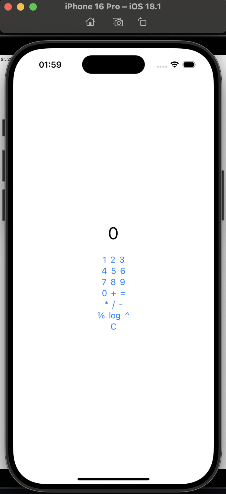

**Zadanie 1** Kalkulator

:white_check_mark: 3.0

:white_check_mark: 3.5

:white_check_mark: 4.0

:white_check_mark: 4.5

:x: 5.0

Kod: [Folder](https://github.com/mmikusx/ios24-25/tree/main/Calculator/Calculator)

Demo: [Link do demo]()

**Zadanie 2** Lista zadań

:white_check_mark: 3.0 [Link do commita](https://github.com/mmikusx/ios24-25/commit/b551f689d2ae079dce02c7ee717c694cbf9ba965)

:white_check_mark: 3.5 [Link do commita](https://github.com/mmikusx/ios24-25/commit/1b7c5e1b44a2467fead3d25e2db14185e4f79ba4)

:white_check_mark: 4.0 [Link do commita](https://github.com/mmikusx/ios24-25/commit/5b06eb571c49ed4917cdddb9857daa9f108e3562)

:white_check_mark: 4.5

:white_check_mark: 5.0 [Link do commita](https://github.com/mmikusx/ios24-25/commit/1b29d4602bd506fc783f963eb49750ff374867ee)

Kod: [Folder](https://github.com/mmikusx/ios24-25/tree/main/TaskList/TaskList)

Demo: [Link do demo]()

**Zadanie 3** Lista zakupów

:white_check_mark: 3.0 [Link do commita](https://github.com/mmikusx/ios24-25/commit/adc5be53258365afdde0e3c66c72e2b79bab32db)

:white_check_mark: 3.5 [Link do commita](https://github.com/mmikusx/ios24-25/commit/35f45ca77d05ce02fc9c8dba085abefd6902d4e6)

:white_check_mark: 4.0 [Link do commita](https://github.com/mmikusx/ios24-25/commit/89a4dd32bc4e6a4f7b60fd2cf7119e5c6fcab21a)

:white_check_mark: 4.5

:white_check_mark: 5.0 [Link do commita](https://github.com/mmikusx/ios24-25/commit/7e5fa15c46be8086d2ff1afb90fb118b0482c669)

Kod: [Folder](https://github.com/mmikusx/ios24-25/tree/7e5fa15c46be8086d2ff1afb90fb118b0482c669/ShopList/ShopList)

Demo: [Link do demo]()

**Zadanie 4** Sieć

:white_check_mark: 3.0 [Link do commita](https://github.com/mmikusx/ios24-25/commit/4e90843bda39fd560e40ac5cadce3d6e56c4a117)

:white_check_mark: 3.5 [Link do commita](https://github.com/mmikusx/ios24-25/commit/e6704549952029ded0b833503dbbefa76c97b167)

:white_check_mark: 4.0 [Link do commita](https://github.com/mmikusx/ios24-25/commit/652f9a01a40465205d3f4aab27a9c0cc8a5ae9bf)

:white_check_mark: 4.5 [Link do commita](https://github.com/mmikusx/ios24-25/commit/d04ea50da8ea771f2b4ae1f6b6b842a88c2e8229)

:white_check_mark: 5.0 [Link do commita](https://github.com/mmikusx/ios24-25/commit/8c65e9826bcf612cf74f23e058a371debe72e678)

Kod: [Folder](https://github.com/mmikusx/ios24-25/tree/main/ShopList/ShopList)

Demo: [Link do demo]()

**Zadanie 5** OAuth2

:white_check_mark: 3.0 [Link do commita](https://github.com/mmikusx/ios24-25/commit/da6eaeb31ecf0bdd5459f287b06b917058d0331e)

:white_check_mark: 3.5 [Link do commita](https://github.com/mmikusx/ios24-25/commit/e0a3b0eb8bf02f7fd046a97acfb2be834e604505)

:x: 4.0

:x: 4.5

:x: 5.0

Kod: [Folder](https://github.com/mmikusx/ios24-25/tree/main/LoginApp/LoginApp)

Demo: [Link do demo]()